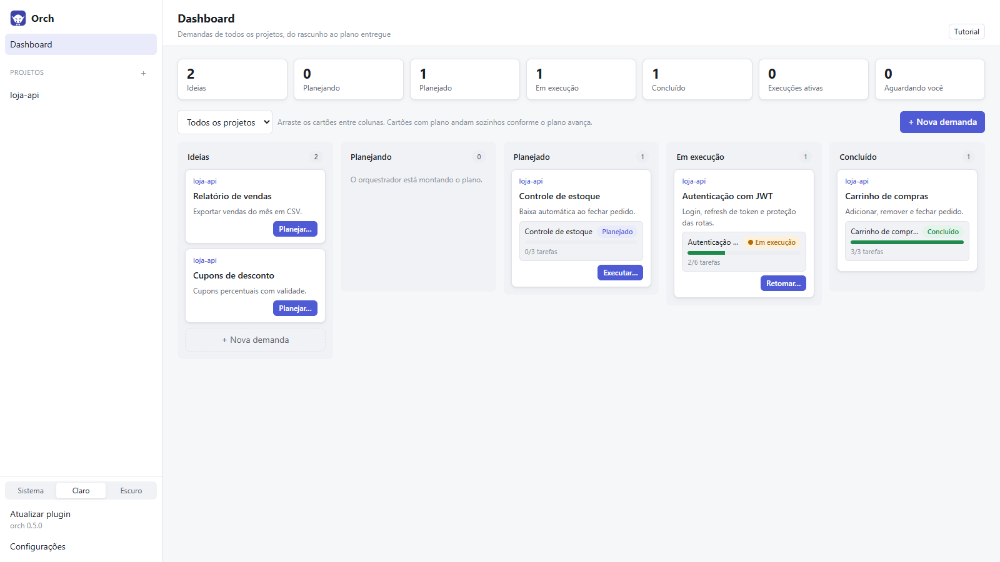
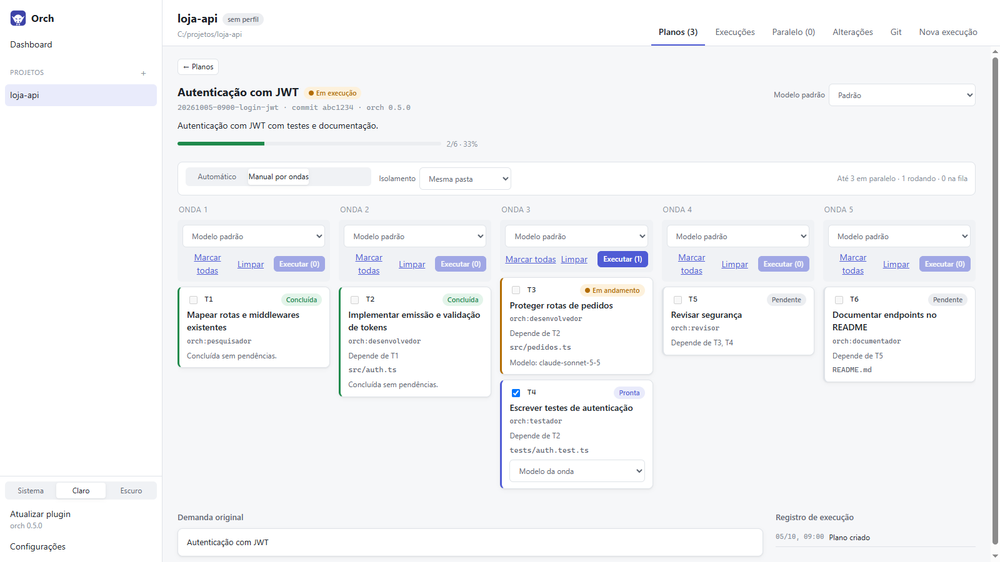
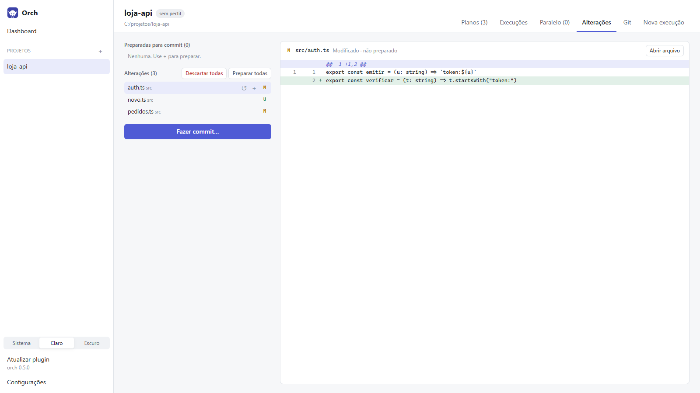

# Orch — app desktop

Interface gráfica (Windows) para o plugin [orch](https://github.com/RKXP-Software/orch) do Claude Code: inicie demandas, aprove permissões, responda perguntas e acompanhe o progresso de cada plano ao vivo.

## Capturas de tela

**Dashboard**: quadro kanban das demandas, do rascunho ao plano entregue.



**Plano em modo manual por ondas**: marque as tarefas prontas, escolha o modelo por onda ou por tarefa e execute.



**Alterações**: arquivos modificados do projeto, com diff e commit.



> Capturas feitas com um projeto de demonstração fictício.

## O que faz

- **Dashboard**: quadro kanban de demandas (Ideias → Planejando → Planejado → Em execução → Concluído). Cada cartão descreve o que deve virar um plano; **Planejar…** manda o cartão para o orquestrador (com escolha de modelo e permissões) e o cartão passa a seguir o plano gerado. Gravado no projeto em `.claude/orch/quadro.json`.
- **Projetos**: escolha as pastas em que o Claude vai trabalhar.
- **Nova execução**: Orquestrar, Só planejar, Especializar, Criar agente ou prompt livre, com **escolha do modelo** (lista vinda do próprio Claude Code) e do modo de permissões.
- **Rodar no app ou no CLI**: no app, a execução tem duas visões, **Conversa** e **Terminal** (estilo CLI, com a saída de cada ferramenta). **Abrir no CLI do Claude** abre o Claude Code interativo numa janela de terminal, com o mesmo prompt e modelo.
- **Permissões e perguntas** do Claude viram cartões para aprovar ou responder. O **modo de permissão** pode ser trocado durante a execução: Perguntar sempre, Aceitar edições, Automático, **Sem confirmações** (aprova tudo; só perguntas de planejamento e aprovação de plano chegam a você) e Somente leitura.
- **Contexto** de cada execução: tokens usados e a janela do modelo, por categoria (como o `/context` do CLI).
- **Planos**: lista e detalhe com tarefas organizadas em ondas, status ao vivo, registro de execução e botão Executar/Retomar. Dois modos de execução:
  - **Automático**: uma sessão executa o plano inteiro (o orquestrador agenda as tarefas, respeitando o limite de paralelismo).
  - **Manual por ondas**: cada tarefa roda numa **sessão própria**. Marque os checkboxes das tarefas prontas de uma onda e clique em **Executar (n)**; escolha o **modelo por onda ou por tarefa** (ex.: Opus na onda 1, Sonnet nas demais). O que passar do limite de paralelismo entra numa **fila** e começa quando houver vaga. Tarefas que falharam podem ser repetidas ou puladas.
- **Atualizar plugin**: atalho na barra lateral (e botão em Configurações) que atualiza o plugin orch instalado no Claude Code (`claude plugin marketplace update` + `claude plugin update`).
- **Paralelo**: aba do projeto que mostra de 1 a 6 conversas lado a lado, para acompanhar cada tarefa individualmente. Na conversa de uma tarefa, o painel lateral lista as outras em execução.
- **Isolamento** (por configuração ou por execução): tarefas na **mesma pasta** (padrão, com aviso de arquivos em comum), num **branch do plano** (`orch/<id>`) ou numa **worktree por tarefa** (só no manual), com merge **manual** (botão Mesclar) ou **automático** ao concluir. Conflito de merge é desfeito e a tarefa fica aguardando você. Na lateral da execução, tarefas que um agente acabou de pegar aparecem em andamento na hora, antes de o plano ser regravado.
- **Execuções gravadas**: cada execução fica em `.claude/orch/execucoes/<data>-<título>.json` (conversa, ferramentas e saídas, aprovações, modelo, custo, contexto). A aba **Execuções** do projeto lista o histórico; uma execução antiga abre completa e pode ser **continuada**, retomando a mesma conversa do Claude.
- **Alterações**: arquivos modificados, preparados e novos do projeto, com diff; preparar, tirar da preparação e descartar.
- **Git**: branch atual e sincronização (fetch, pull, push / publicar branch), commit, branches (trocar, criar, apagar) e histórico. Usa o git instalado na máquina.
- **Notificações do Windows** quando uma execução espera aprovação ou resposta e o app não está em foco (desligável em Configurações).
- Tutorial na tela inicial, tema claro/escuro/sistema.

## Como funciona

O app não reimplementa o orquestrador: ele executa o Claude Code de verdade pelo [Claude Agent SDK](https://www.npmjs.com/package/@anthropic-ai/claude-agent-sdk) e lê os planos que o plugin grava no projeto.

```
Processo principal (Node)                      Interface (React)
├─ GerenciadorSessoes  → Agent SDK (query)  ──▶ execução: conversa/terminal, permissões, perguntas
├─ ObservadorPlanos    → .claude/orch/planos ──▶ planos e tarefas ao vivo
├─ terminal.ts         → abre o CLI / login
└─ armazenamento.ts    → projetos e configurações (%APPDATA%/Orch/orch-app.json)
```

- **Vínculo cartão ↔ plano**: o prompt enviado pelo quadro termina com `[quadro:<id do cartão>]`; o orch grava a demanda literal no plano, e o app usa a marca para ligar o plano ao cartão.
- **Contrato com o plugin**: `.claude/orch/planos/<id>.json` (schema `orch.plano/1`, plugin ≥ 0.4.0; modo manual por ondas: plugin ≥ 0.5.0). No modo manual o app grava o estado das tarefas (campos extras `modelo`, `sessaoApp`, `pasta`, `merge`) e cada tarefa roda com `/orch:orquestrar --tarefa <plano> <Tn>`. Planos de versões anteriores são lidos do `.md`, com aviso. O parser fica em [src/shared/plano.ts](src/shared/plano.ts).
- **Login**: o app usa o login do Claude Code desta máquina (`claude auth login`). Sem login, uma faixa no topo oferece o botão **Fazer login**.
- **Plugin**: por padrão, o orch instalado no Claude Code (configurações de usuário/projeto). Em **Configurações** dá para apontar uma pasta local do plugin, que é carregada com `--plugin-dir`.
- **Executável**: o binário do Claude Code que vem com o SDK. Pode ser trocado em Configurações.
- **Sem confirmações** é aplicado pelo app ([src/shared/permissoes.ts](src/shared/permissoes.ts)), não pelo `bypassPermissions` do SDK: assim `AskUserQuestion` e `ExitPlanMode` sempre chegam ao usuário, e as regras `deny` das configurações continuam valendo. No CLI externo, o modo vira `--dangerously-skip-permissions`.

## Desenvolvimento

Requisitos: Node 22+ e Windows.

```bash
npm install
```

```bash
npm run dev
```

| Script | Faz |
|---|---|
| `npm run dev` | App com hot reload |
| `npm run typecheck` | TypeScript (processo principal e interface) |
| `npm test` | Testes do parser de planos (Vitest) |
| `npm run dist` | Instalador Windows (NSIS) em `release/<versão>/Orch-Setup-<versão>.exe` |

### Atualizar uma instalação

Gere o instalador com `npm run dist` (suba a `version` do `package.json` antes) e execute `release/<versão>/Orch-Setup-<versão>.exe` **por cima** da instalação existente: ele fecha o app, troca os arquivos na mesma pasta e abre a nova versão. Projetos, configurações (`%APPDATA%/Orch`) e execuções gravadas (`.claude/orch/` de cada projeto) não são tocados. O plugin orch é atualizado à parte (`/plugin marketplace update` no Claude Code, ou a pasta local em Configurações).

Se `npm run dev` falhar com "Electron uninstall", o binário do Electron não foi baixado: `node node_modules/electron/install.js`.

Ao rodar o app de dentro de uma sessão do Claude Code (terminal integrado do app desktop, por exemplo), as variáveis `CLAUDE_*` daquela sessão são herdadas pelo SDK. Para testar como um usuário final, abra o app por um terminal comum.

### Estrutura

```
src/
  shared/    tipos e leitura de planos (usados pelo main e pela interface)
  main/      processo principal: sessões (SDK), observador de planos, terminal, armazenamento
  preload/   ponte IPC segura (window.orch)
  renderer/  interface React
tests/       testes do parser + fixtures de planos (.json e .md)
```
